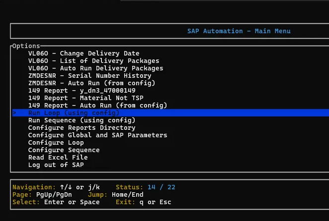

# SAP Automation

A Rust-based utility for automating SAP GUI interactions.

## Description

This project provides tools for automating SAP GUI operations using Rust. It leverages the Windows COM interface to interact with the SAP GUI Scripting API, allowing for programmatic control of SAP sessions.

Key features include:

- Automated SAP login with credential management
- Secure storage of encrypted credentials
- Handling of multiple logon scenarios
- Interaction with SAP GUI controls (buttons, text fields, checkboxes, etc.)
- Management of popups and error messages
- Support for transaction code execution and verification
- Data export capabilities
- Per-tcode configuration management
- **Command-line interface for unattended automation**
- **Loop and sequence execution without user interaction**

## Terminal User Interface (TUI)

This application features a modern terminal user interface built with [ratatui](https://github.com/ratatui-org/ratatui), providing an intuitive and responsive menu system for navigating SAP automation features.

### TUI Features

The TUI provides:

- **Interactive Menu Navigation**: Easy-to-use selection menus for all application features
- **Real-time Status Display**: Shows current selection position and total items
- **Responsive Design**: Adapts to different terminal sizes
- **Keyboard Shortcuts**: Efficient navigation using familiar key combinations

### Menu Example

The application presents a clean, organized menu interface for selecting SAP automation operations:



The menu displays:

- **Title Bar**: Shows the current menu context
- **Selection List**: Available options with highlighted current selection
- **Status Bar**: Current position and total items
- **Navigation Instructions**: Quick reference for available controls

### Navigation Controls

The TUI supports the following navigation controls:

| Action             | Keys                    |
| ------------------ | ----------------------- |
| **Move Up**        | `↑` (Up Arrow) or `k`   |
| **Move Down**      | `↓` (Down Arrow) or `j` |
| **Page Up**        | `PgUp`                  |
| **Page Down**      | `PgDn`                  |
| **Jump to Top**    | `Home`                  |
| **Jump to Bottom** | `End`                   |
| **Select Item**    | `Enter` or `Space`      |
| **Exit/Cancel**    | `q` or `Esc`            |

### TUI Components

The TUI system includes several specialized components:

- **Selection Menus**: Standard list-based selection for choosing operations
- **Grid Menus**: Alternative grid layout for better organization of many options
- **Input Dialogs**: Text input prompts for configuration and data entry

All TUI components maintain consistent navigation patterns and visual styling for a cohesive user experience.

## Command Line Interface (CLI)

The application also supports command-line operation for automation scenarios. This allows you to run SAP automation tasks without any user interaction, making it perfect for:

- **Scheduled tasks and batch processing**
- **CI/CD pipeline integration**
- **Automation scripts**
- **Testing and validation**

### Three Execution Modes

| Mode | Trigger | Description |
| --- | --- | --- |
| **Loop** | `run-loop` subcommand or `--run-loop` flag | Repeats a single TCode auto-flow on a timer (uses `[loop]` config). |
| **Sequence** | `run-sequence` subcommand or `--run-sequence` flag | Runs a list of menu options in order on a timer (uses `[sequence]` config). |
| **Single-shot** | `--tcode=<X>` on its own | Runs the auto-flow for one TCode once and exits. |

### Quick Examples

```bash
# Show help (lists every flag)
./sap_automation.exe --help

# Loop the configured TCode (uses [loop] from config.toml)
./sap_automation.exe run-loop
./sap_automation.exe --run-loop

# Sequence (uses [sequence] from config.toml)
./sap_automation.exe run-sequence
./sap_automation.exe --run-sequence

# Single-shot run of VT11 with overrides; no config.toml required
./sap_automation.exe --tcode=vt11 --layout=ob_6 --variant=ob_win --export-type=1

# Override loop timing + iterations from CLI; flags win over config
./sap_automation.exe --run-loop --tcode=vt11 --iterations=3 --delay-seconds=30

# 149 report (requires --tcode-run-type)
./sap_automation.exe --run-loop --tcode=y_dn3_47000149 --tcode-run-type=rcv

# Filter VT11 by an arbitrary delivery list and date range
./sap_automation.exe --tcode=vt11 --by-delivery=true \
  --delivery-file=C:\out\dn.csv --delivery-col="Delivery Number" \
  --by-date=true --date-start=2026-02-01 --date-end=2026-02-15
```

### CLI vs config.toml

CLI flags **always win** over `config.toml`, and they work even when `config.toml` is missing. When at least one override is in play, the runner prints a one-line summary like
`CLI overrides applied (these win over config.toml): --tcode=VT11 --iterations=3` so you can see what's being applied before the SAP work starts.

`--run-sequence` is intentionally config-driven — passing per-tcode flags (`--tcode`, `--layout`, `--by-date`, etc.) with `--run-sequence` is rejected up-front so you don't accidentally apply VT11 settings to a multi-tcode run.

### Key Benefits

- **No User Interaction**: Runs completely automatically
- **Configuration Driven**: Uses your existing `config.toml` settings; CLI flags can override any value
- **Error Handling**: Clear error messages and exit codes; missing required flags fail fast (e.g. `Missing flag for tcode-run-type, enter with --tcode-run-type=rcv|mat|tsp`)
- **Logging**: All output goes to console for easy logging
- **Backward Compatible**: Interactive mode remains unchanged

For the full flag reference, validation rules, source-file resolution, and end-to-end examples, see [COMMAND_LINE_USAGE.md](COMMAND_LINE_USAGE.md).

## Sequence Menu Option IDs

These IDs match the current main menu and can be used in the sequence configuration:

- 2: VT11 - Auto Run
- 4: VT11 - ListCheck Auto
- 6: ZVT11 - Auto Run
- 8: VL06O - Auto Run
- 11: VL06O - Delivery Packages Auto Run
- 13: ZMDESNR - Auto Run
- 18: 149 Report - Auto Run
- 19: Inbond - Shipment to 149

### Inbond - Shipment to 149

Interactive clerk flow (menu option **Inbond - Shipment to 149**):

1. Prompt for a shipment number
2. Run **VL06O** with variant from `[inbond].vl06o_variant` (default `blank_`)
3. Export the delivery list, parse and **dedupe** delivery numbers
4. Run **y_dn3_47000149** with variant/layout `inb_ship` (configurable), paste deliveries into `S_DELIV`
5. Export a timestamped paste-ready `.txt` and open it in Notepad

Clerk then pastes the file into `material.php` `#clipboard`, types the shipment into `#shipmentInput`, and clicks `#splitBtn`.

This path does **not** use `exec_rest` (no browser/GUI upload).

```toml
[inbond]
vl06o_variant = "blank_"
variant_149 = "inb_ship"
layout_149 = "inb_ship"
layout_columns = [
  "Plant",
  "Delivery Number",
  "Material",
  "Quantity",
  "UOM",
  "Logistics Reference Number"
]
export_type = 1
open_notepad = true
```

If `layout_149` is missing in SAP (or empty), the flow sets up `layout_columns` via Change Layout and asks whether to save under that name (default `inb_ship`). When you confirm and SAP save succeeds, `[inbond].layout_149` is written/updated in `config.toml` so the next run uses the confirmed name.

## Dependencies

This project relies on the following key dependencies:

- `sap-scripting` - A Rust library for interacting with SAP GUI Scripting API, created by Lily Hopkins (https://github.com/lilopkins/sap-scripting-rs)
- `windows` - For Windows COM interface integration
- `aes-gcm` and `base64` - For secure credential encryption
- `dialoguer` and `crossterm` - For terminal UI components
- `toml` and `serde` - For configuration file parsing and serialization

## Configuration

### Setting Up Your Configuration

The application uses a `config.toml` file for configuration. To get started:

1. Copy the example configuration file:

   ```
   copy config.toml.example config.toml
   ```

2. Edit the `config.toml` file to match your environment and requirements

### Configuration System

The configuration system has been redesigned to support:

- Global settings that apply to all operations
- Per-tcode settings that apply only to specific transaction codes
- Loop operation settings for automated repetitive tasks

For detailed information about the configuration system, see [CONFIG.md](CONFIG.md).

### Configuration Sections

The configuration file is divided into several sections:

#### [build] Section

- `target` - Specifies the build target architecture (e.g., `i686-pc-windows-msvc` for 32-bit Windows)

#### [global] Section

- `instance_id` - SAP instance identifier (default: "rs")
- `reports_dir` - Directory where reports will be saved (default: User's Documents\Reports folder)
- `default_tcode` - Default transaction code to execute (e.g., "VL06O")

#### [tcode.XXX] Sections

Each transaction code can have its own configuration section:

```toml
[tcode.VT11]
variant = "testing_7"
layout = "my_layout"
date_range_start = "01/01/2023"
date_range_end = "12/31/2023"
```

#### [loop] Section

Configuration for loop operations:

```toml
[loop]
tcode = "VT11"
iterations = "4"
delay_seconds = "15"
```

### Migration from Legacy Format

If you're upgrading from a previous version, you can use the migration tool to convert your configuration file to the new format:

```
cargo run --bin migrate_config
```

## Usage

The main binary provides a simple interface for logging into SAP:

```
cargo run --bin sap_login
```

This will present a menu with options to log in to SAP, with support for saving encrypted credentials for future use.

The application looks for credentials in the user's Documents folder under `SAP/cryptauth_*.txt`. The instance ID can be configured via the `SAP_INSTANCE_ID` environment variable or in the configuration file.

## Line Endings

This project uses Git's line ending normalization to ensure consistent behavior across different operating systems. The `.gitattributes` file configures:

- Automatic line ending normalization for most text files
- LF (Unix-style) line endings for shell scripts (\*.sh)
- CRLF (Windows-style) line endings for batch files (\*.bat)

If you encounter line ending issues when committing changes, make sure you have the `.gitattributes` file in your repository.
